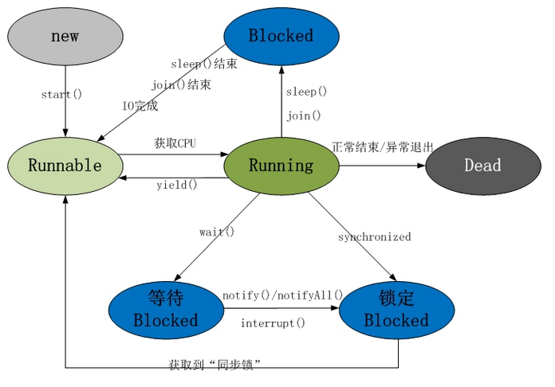

## Thread实践笔记

#### 1.基础知识
1.  线程共有5个状态，分别是新建态、就绪态、运行态、阻塞态、死亡态
2.  时间片轮转调度算法:定义了一个时间单元，也称为时间片。一个时间片一般为
1-100ms,当正在运行的线程用完了时间片后，即使线程还要运行，操作系统也不允许
其运行，而是从就绪队列中依次选择就绪状态的线程进行执行。而被剥夺CPU的进程则被
添加至就绪队列的末尾，等待再次被调度。
3.  创建线程的方法:1.继承Thread类，重写run方法，然后new出Thread子类。2.
实现Runnable接口，重写run方法,然后以该实例作为Thread的target。3.实现
Callable接口，重写call方法，将Mycallable实例对象作为FutureTask的target,
同时Thread包装FutureTask对象。
4.  Runnable接口和Callable接口的区别，Runable无返回值，而Callable有返回值
并且结合FurureTask获取获取Callable中执行体的结果。
5.  不能对同一线程实调用两次start方法。
6.  FutureTask的调用get()方法会处于阻塞状态，直到子线程call()方法执行完毕。

#### 2.源码阅读
1.  线程共有十个优先级，最小为1，默认为5，最大为10，线程优先级越高，获得CPU的
调度优先级也越高，JVM线程调度策略是基于时间片的抢占式调度算法。
2.  Thread类调用静态方法sleep(),状态发生转移，会使处于运行态的线程会释放CPU控制权，
进而切换成阻塞态，但不会释放对象锁。但是Object对象的wait()方法被调用时，会立刻释放
CPU控制权，并且释放对象锁。

#### 3.线程状态图

